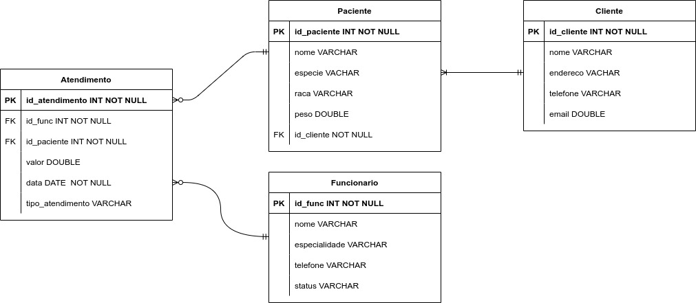

# Projeto Pet System
## Módulo Banco de Dados
Nesse módulo, foi proposto a criação um banco de dados PostgreSQL e utilizamos os dados de uma clínica veterinária para desenvolvimento do projeto.

Foram criadas as tabelas Atendimentos, Clientes, Pacientes e Funcionários e realizadas consultas para extrair dados estatísticos do banco de dados.

Acesse o dashboard com as consultas e queries utilizadas [clicando aqui](dashboard_consultas.xlsx).

Acesse os scripts SQL usados para criar as tabelas e realizar as consultas [clicando aqui](scripts_sql).


## Diagrama Entidade-Relacionamento



## Conexão com banco de dados usando Python
### Diretório

```bash
├── data
│   └── atendimento.json
│   └── clientes.json
│   └── funcionarios.json
│   └── pacientes.json
├── load_tables.py
├── main.py
├── README.md
├── requirements.txt
```

## Requirements
Os códigos foram desenvolvidos utilizando as seguintes configurações:

- Python 3.11
- pip 23.3.1
- PostgreSQL 16.0

## Executando projeto em um Virtual Enviroment (Windows):

- Crie um ambiente virtual no seu diretório: 
```
python -m venv env
 ```
- Ative o ambiente virtual: 
```
env\scripts\activate
 ```
- Instale as dependencias do projeto:
```
pip install -r requirements.txt
 ```
- Rode o arquivo `main.py`:
```
python main.py
```

## Equipe
- [Gustavo Amorim](https://github.com/gustavoaamorim)
- [João Victor Lemos da Silva ](https://github.com/victorlemos1)
- [Maressa Karen Henrique da Silva](https://github.com/maressakaren)
- [Mariana Franz Marroquim](https://github.com/framzz)
- [Wellington Soares Lopes](https://github.com/Wellington-lopes)